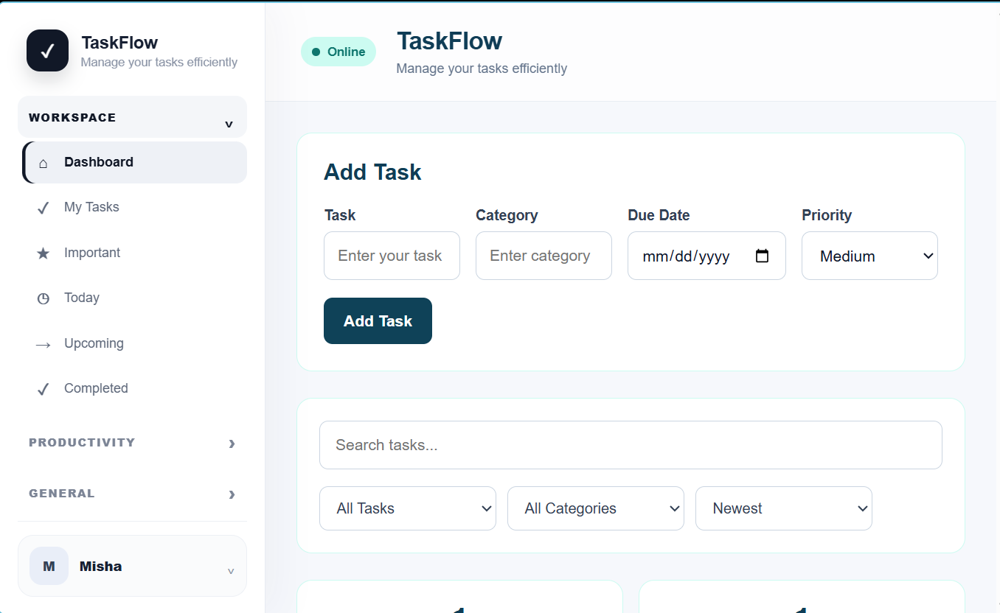
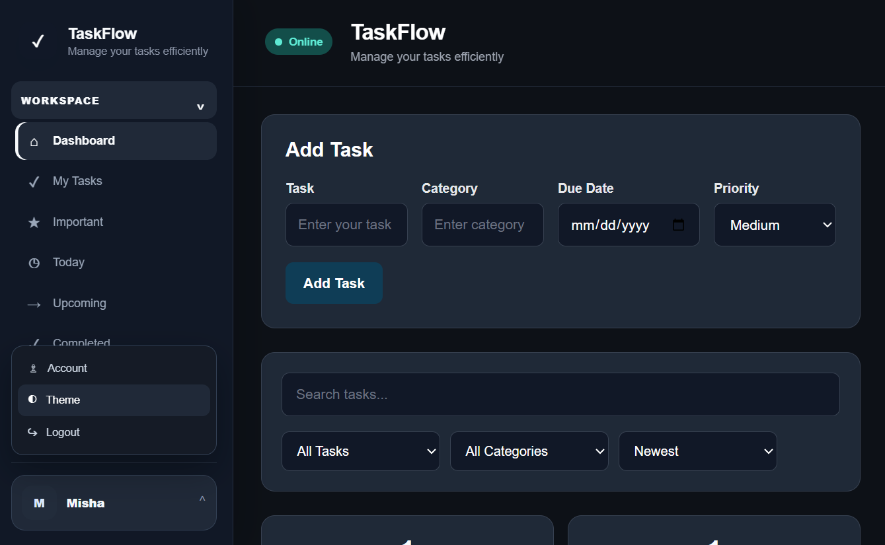
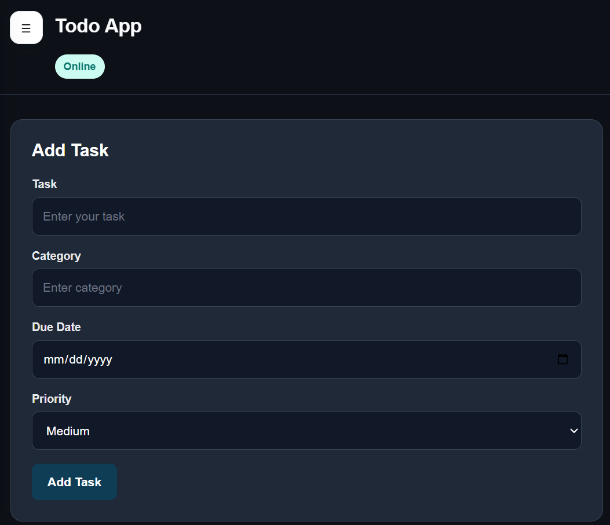

# TaskFlow Todo App

A full-stack productivity Todo app built with React, Redux Toolkit, RTK Query, Express and SQLite.

## Features
- Login / Signup demo authentication
- Todo CRUD with Express + SQLite
- Redux Toolkit + RTK Query
- Search, filtering, sorting, priorities, categories and due dates
- Dashboard sidebar with smart views
- Today, Important, Upcoming and Completed views
- Productivity, Goals, Reminders, Calendar and Categories
- Sync center, activity feed, help, feedback and settings
- Dark mode and English/Urdu language support
- Responsive mobile sidebar
- Reduced-motion accessibility support
## Screenshots

### Dashboard


### Dark Mode


### Mobile Responsive

## Run frontend

```bash
npm install
npm run dev
```

## Run backend

```bash
cd backend
npm install
npm run dev
```

Frontend API URL is configured through `.env` using `.env.example` as the template.

> The current authentication implementation is intended for learning/demo use. Production authentication should use backend password hashing and secure sessions/tokens.


## Backend-free version

TaskFlow now runs as a frontend-only React application. Tasks are stored per user in browser `localStorage`, so no Express server, SQLite database, Railway, or Render backend is required. The app can be deployed as a static site such as GitHub Pages or Vercel.

**Data note:** localStorage is browser/device specific. It is suitable for a portfolio/demo application, not secure multi-device production authentication.
## Live Demo

https://taskflow-todo-beta.vercel.app